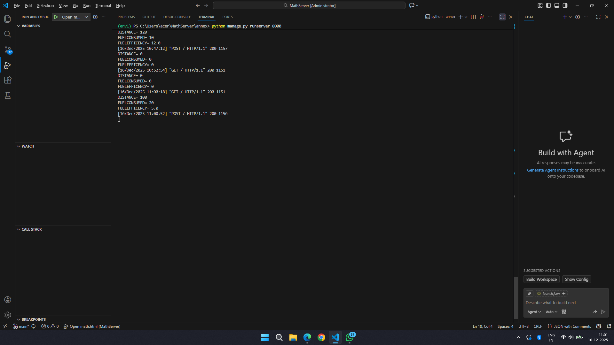

# Ex.04 Design a Website for Server Side Processing
## Date:14/12/2025

## AIM:
To create a web page to calculate vehicle mileage and fuel efficiency using server-side scripts.

## FORMULA:
M = D / F
<br> M --> Mileage (in km/l)
<br> D --> Distance Travelled (in km)
<br> F --> Fuel Consumed (in l)

## DESIGN STEPS:

### Step 1:
Clone the repository from GitHub.

### Step 2:
Create Django Admin project.

### Step 3:
Create a New App under the Django Admin project.

### Step 4:
Create python programs for views and urls to perform server side processing.

### Step 5:
Create a HTML file to implement form based input and output.

### Step 6:
Publish the website in the given URL.

## PROGRAM:
```
<html>
    <head>
        <title>FuelEfficiency</title>
    </head>
    <style>
        .box
        {
            margin-top: 10%;
            margin-left: 20%;
            margin-right:20%;
            border: 4px dashed black; 
            background-color: plum;
            text-align: center; 
        }
    </style>
    <body>
        <div class="box">
        <h1>FUEL EFFICIENCY CALCULATOR</h1>
        <h3>S HARSHITH SANJAI</h3>
        <h3>25014134</h3>
        <br>
        <form method="POST">
            
            <label>Distance Travelled: </label>
            <input type="text" name="distance" value="{{d}}" required> Km
            <br><br>
            <label>Fuel Consumed: </label>
            <input type="text" name="fuelconsumed" value="{{f}}" required> L
            <br><br>
            <input type="submit" value="Calculate">
            <br><br>
            <label>Fuel Efficiency: </label>
            <input type="text" name="efficiency" value="{{fe}}"> Km/L
        </form>
        </div>
    </body>
</html>
```


## OUTPUT - SERVER SIDE:


## OUTPUT - WEBPAGE:

.png>)
## RESULT:
The a web page to calculate vehicle mileage and fuel efficiency using server-side scripts is created successfully.
